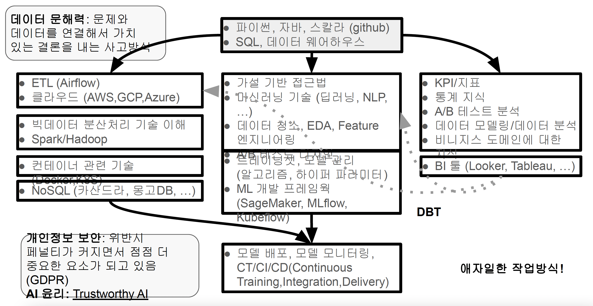

Data Engineering Side

- 데이터 웨어하우스 기반으로 데이터 인프라를 만드는 것

- Data Analyst와 어떻게 협업해야 하는지
    - Summary Table & Dashboard
- Data Scientist와 어떻게 협업해야 하는지
    - Feature 계산
        - 이는 큰 스케일에서는 Feature 계산을 위해 Spark와 같은 대용량 분산 계산 프레임워크가 필요
        - 작은 스케일에서는 Python의 Pandas와 같은 라이브러리 사용이 필요
    - Model Serving
        - Data Scientist가 만든 모델을 어떻게 프로덕션으로 론치할 수 있을까?
    - A/B Test 분석 파이프라인 (데이터 분석과 협업)
- MLOps와 ML Engineer

파이썬, SQL & Data Warehouse, ETL (Airflow), Spark(대용량 분산처리)

데이터 관련 직군의 일

MLOps란?

- DevOps가 하는 일은?
    - 개발자가 만든 코드를 시스템에 반영하는 프로세스 (CI/CD, deployment)
    - 시스템이 제대로 동작하는지 모니터링 그리고 이슈 감지시 escalation 프로세스
        - On-call 프로세스
- MLOps가 하는 일은?
    - 앞의 DevOps가 하는 일과 동일. 차이점은 개발자 코드가 아니라 ML 모델이 대상이 된다는 점
    - 어떻게 ML모델 개발을 더 쉽게하고 자동화하여 자주 모델 빌딩을 하고 이를 프로덕션으로 론치할 수 있을까?
    - 모델 서빙 환경에 문제가 생기거나 모델의 성능이 떨어질 경우 (data drift) 이를 어떻게 감지하고 조치를 취할 수 있을까?