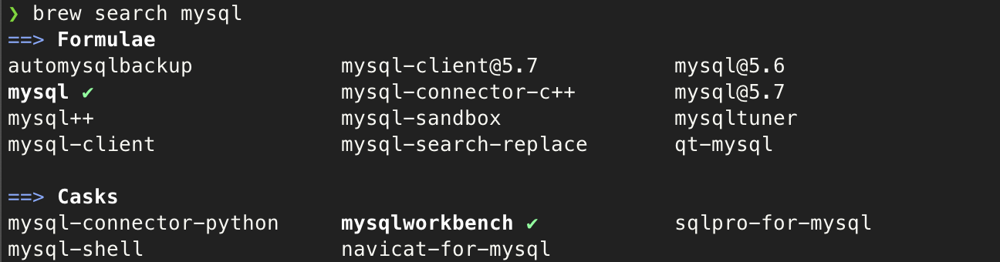
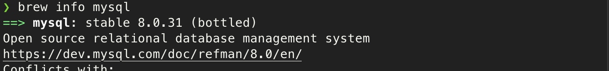
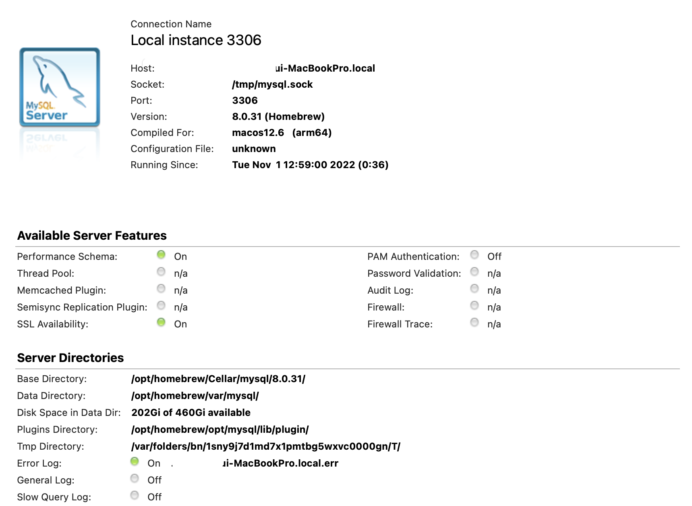

# MySQL 설치

home brew를 통한 설치


1. 설치 가능한 mysql 검색

```bash
> brew search mysql
```



2. mysql 버전 정보 확인

```bash
> brew info mysql
```



3. 설치

```bash
> brew install mysql
```

4. mysql 서비스 시작

```bash
> brew services start mysql
```

종료

```bash
> brew services stop mysql
```


5. mysql 비밀번호 없이 로그인

```bash
> mysql -uroot
```

6. mysql 로그아웃

```bash
mysql> exit
```


7. root계정 설정

    1. VALIDATE PASSWORD 설정 여부 - no
    2. Anonymous Users 삭제 여부 - no

    3. 원격 IP 접속 허용 여부 - yes

    4. 기본 DB인 test 유지 여부 - no

    5. 변경된 설정 내역을 즉시 적용할 건지 - yes

```bash
> mysql_secure_installation
# 비밀번호 설정
Would you like to setup VALIDATE PASSWORD component? Press y|Y for Yes, any other key for No: no

Remove anonymous users? (Press y|Y for Yes, any other key for No) : no

Disallow root login remotely? (Press y|Y for Yes, any other key for No) : yes

Remove test database and access to it? (Press y|Y for Yes, any other key for No) : no

Reload privilege tables now? (Press y|Y for Yes, any other key for No) : yes
```


8. mysql status

```bash
> mysql -u root -p

mysql> status
--------------
mysql  Ver 8.0.31 for macos12.6 on arm64 (Homebrew)

Connection id:		17
Current database:
Current user:		root@localhost
SSL:			Not in use
Current pager:		less
Using outfile:		''
Using delimiter:	;
Server version:		8.0.31 Homebrew
Protocol version:	10
Connection:		Localhost via UNIX socket
Server characterset:	utf8mb4
Db     characterset:	utf8mb4
Client characterset:	utf8mb4
Conn.  characterset:	utf8mb4
UNIX socket:		/tmp/mysql.sock
Binary data as:		Hexadecimal
Uptime:			31 min 12 sec

Threads: 4  Questions: 595  Slow queries: 0  Opens: 231  Flush tables: 3  Open tables: 141  Queries per second avg: 0.317
--------------
```


# MySQL workbench 설치

home brew로 설치


1. home brew cask로 설치

```bash
> brew install mysqlworkbench --cask
```

설치 완료하면 자동으로 응용프로그램에 추가해줌


Mysql Workbench Server 상태




# MySQL 완전 삭제

rangyu님 <a href="https://github.com/rangyu/TIL/blob/master/mysql/MySQL-%EC%99%84%EC%A0%84-%EC%82%AD%EC%A0%9C%ED%95%98%EA%B3%A0-%EC%9E%AC%EC%84%A4%EC%B9%98%ED%95%98%EA%B8%B0-(MacOS).md">github</a> 참고

1. 서비스 종료

```bash
> brew services stop mysql
```

2. 설치 경로 확인

```bash
> which mysql
/usr/local/bin/mysql
```

3. mysql uninstall

```bash
> brew uninstall --force mysql
> brew cleanup
```

4. 다음 라인을 한줄씩 입력해 모두 실행

```bash
> sudo rm -rf /usr/local/mysql
> sudo rm -rf /usr/local/bin/mysql
> sudo rm -rf /usr/local/var/mysql
> sudo rm -rf /usr/local/Cellar/mysql
> sudo rm -rf /usr/local/mysql*
> sudo rm -rf /tmp/mysql.sock.lock
> sudo rm -rf /tmp/mysqlx.sock.lock
> sudo rm -rf /tmp/mysql.sock
> sudo rm -rf /tmp/mysqlx.sock
> sudo rm ~/Library/LaunchAgents/homebrew.mxcl.mysql.plist
> sudo rm -rf /Library/StartupItems/MySQLCOM
> sudo rm -rf /Library/PreferencePanes/My*
```

5. 컴퓨터 재부팅
