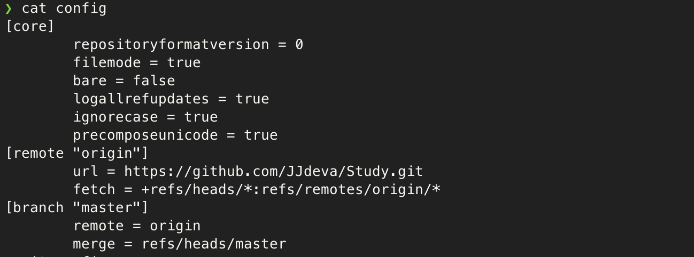

# 리포지토리 생성

지역 저장소 생성하기

## init

깃 지역 저장소로 쓸 디렉토리에서 init 명령을 실행

```bash
> git init
```

이 때 디렉토리는 깃 리포지토리로 초기화되면서 `.git`이란 디렉토리가 생성된다.

`.git` 디렉토리에는 깃 지역 저장소에서 관리하는 파일, 브랜치, 설정 정보 등이 담겨 있다.
이 안에 내용은 사용자가 직접 수정할 일은 거의 없고 커맨드를 통해 깃에 의해 자동으로 관리 된다.


## init 취소

git init을 취소하는 방법은 `.git` 디렉토리를 삭제하면 된다.

```bash
> rm -rf .git
```


# 환경설정

## 사용자 등록

`git init`을 통해 로컬 리포지토리를 생성했으면 해당 저장소에 사용자에 대한 정보를 등록해야 한다.

여러 사용자가 함께 쓸 수 있는 환경이기에 누가, 무엇을 어떻게 변경했는지 알려면 사용자를 등록하게 필요하기 때문

```bash
> git config user.name "사용자 이름"
> git config user.email "이메일 주소"
```

위의 config에 사용자 등록은 local 범위에 해당하는 것
회사 프로젝트와 개인 프로젝트를 분리하고 싶다면 따로따로 지정하자.


컴퓨터를 나혼자 사용한다면 `--global`을 써서 전역으로 설정해서 쓰자.

```bash
> git config --global user.name "사용자 이름"
> git config --global user.email "이메일 주소"
```


## 깃 설정 파일 확인

깃 설정 파일을 확인 해보자.

`.git` 디렉토리 안에 `config`파일을 확인해보면 된다.



core 섹션

- repositoyformatversion
    - 현재 깃 저장소의 형식 및 버전 식별에 쓰이는 변수
- filemode
    - 저장소에 포함된 파일 모드의 변경 감지 여부 설정
    - 파일 시스템이 다른 곳에서 동시작업하면 변경이 없어도 변경되었다고 표시될 수도 있다.
- bare
    - 현재 저장소가 코드 변경, 작업 용도가 아닌 현재까지 작업을 복사하는 용도로 쓸 때 true로 설정
    - 보통 원격 중앙 저장소를 만들 때 씀
- logallrefupdates
    - 깃 커맨드를 통해 수행되는 작업 내역을 기록하는 reflog를 활성화
    - `git reflog`를 통해 기록된 작업 내역 확인 가능
- ignorecase
    - 대소문자 구분 여부로 true일 때 대소문자 구분 안함
- precomposeunicode
    - macOS에서 쓰는 설정
    - 맥은 유니코드 정규화 방식이 달라서 파일명이 한글이면 파일 인식을 못하는 문제가 있을 수 있어 true로 설정해줘야 문제가 없음

core 섹션은 변경할 일이 거의 없다. 그냥 기본값을 쓰자.


## 깃 원격 저장소 설정


## .gitignore 파일 설정
