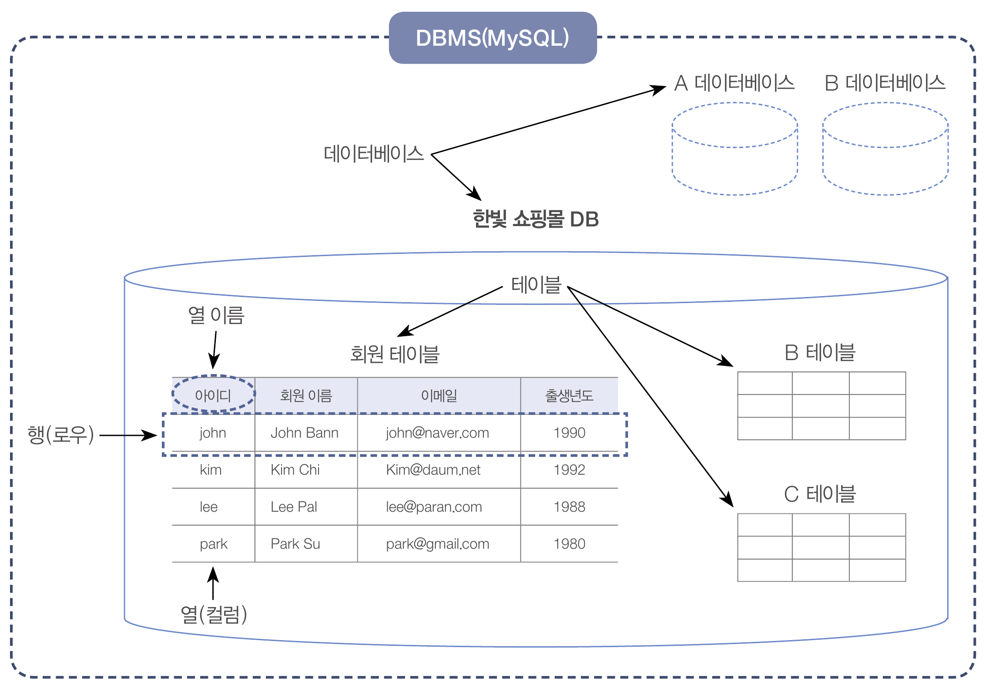

# MySQL을 파이썬에서 써보자 - 1

# mysqlclient 설치

mysqlclient 설치

```
pip install mysqlclient
```


# 계정 생성

mysql 서버에 root로 접속하자.

```mysql
mysql> USE mysql;
mysql> CREATE USER 'myuser'@localhost IDENTIFIED BY 'qwer1234';
mysql> grant all privileges on *.* to myuser@'localhost' with grant option;
```


# DB 생성

구축할 MySQL 데이터베이스




데이터 베이스 생성

```mysql
DROP DATABASE IF EXISTS hanbitDB;
CREATE DATABASE hanbitDB;
```


# MySQL 데이터 입력

파이썬에서 MySQL에 연결해서 데이터를 입력하는 방법을 알아보자.


## 단계

1. MySQL 연결
    - `연결자 = MySQLdb.connect(연결옵션)`
2. 커서 생성
    - `커서이름 = 연결자.cursor()`
3. 테이블 만들기
    - `커서이름.execute("CREATE TABLE 문장")`
4. 데이터 입력
    - `커서이름.execute("INSERT 문장")`
5. 입력한 데이터 저장
    - `연결자.commit()`
6. MySQL 연결 종료
    - `연결자.close()`


## 데이터 베이스 연결

먼저 mysqlclient에서 MySQLdb 모듈을 임포트하자.

```python
import MySQLdb
```


MySQL서버에 연결하기

```python
conn = MySQLdb.connect(host="localhost", user="myuser", password='qwer1234', db='hanbitDB', charset='utf8')
```


커서 생성

- 커서는 데이터베이스에서 SQL문을 실행하거나, 실행된 결과를 돌려받는 통로로 생각하면 된다.

```python
cur = conn.cursor()
```


테이블 만들기

`cur.execute()` 함수의 매개변수에 명령어를 넣어주면 sql서버로 전송된다.

```python
cur.execute("CREATE TABLE IF NOT EXISTS userTable (id char(4), userName char(15), email char(20), birthYear int)")
```


데이터 입력

```python
cur.execute("INSERT INTO userTable VALUES ('john', 'John Bann', 'john@naver.com', 1990)")
cur.execute("INSERT INTO userTable VALUES ('kim', 'kim Chi', 'kim@daum.net', 1992)")
cur.execute("INSERT INTO userTable VALUES ('lee', 'Lee Pal', 'lee@paran.com', 1988)")
cur.execute("INSERT INTO userTable VALUES ('park', 'Park Su', 'park@gmail.com', 1980)")
```


입력 데이터 저장

- 위에서 execute로 입력한 데이터는 임시저장이다. 이를 반영하려면 commit을 날려야 한다.

```python
conn.commit()
```


데이터베이스 닫기

- 데이터베이스를 모두 사용했다면 연결한 데이터를 닫아야한다.

```python
conn.close()
```

